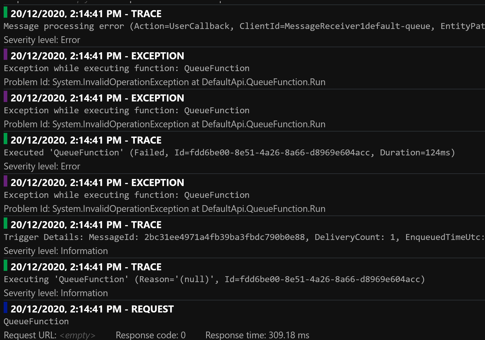

# Azure Functions Limitations

This project demonstrates the limitations of Azure Functions in three areas:

- Http binding
- Development experience
- Application Insights integration

This project is supporting the blog post I wrote about [Azure Functions and their limitations][blog-post].

## Prerequisites

- [Azurite][azurite] is used as the Azure blob emulator
- [Azure Functions Core Tools][azure-functions-core-tools] if you want to run from the command line
- [Powershell 7][powershell-7] to deploy to Azure
- [Azure PowerShell][azure-powershell] to deploy to Azure

## Software versions

I used the Azure Functions Core Tools version `3.0.3160` to create the Function App (released on the 9th of December 2020).

NuGet packages:

- `Microsoft.NET.Sdk.Functions`: `3.0.7` (added automatically when creating the Function)
- `Microsoft.Azure.Functions.Extensions`: `1.1.0` (added manually following [Use dependency injection in .NET Azure Functions][dependency-injection])
- `Microsoft.Extensions.DependencyInjection`: `3.1.10` (added manually following [Use dependency injection in .NET Azure Functions][dependency-injection])
- `Microsoft.Azure.WebJobs.Logging.ApplicationInsights`: `3.0.23` (added manually following [Log custom telemetry in C# functions][custom-telemetry])

## Getting started

Run `deploy.ps1` to deploy the project to Azure. This will deploy:

- An Application Insights instance
- A Service Bus namespace
- A Function App and its supporting storage account

```powershell
.\deploy.ps1 -Location {AzureRegion} -ResourceNamePrefix {UniquePrefix}
```

## Default Function App

`DefaultApi` demonstrate the limitations of Azure Functions.

I've decided to commit the `local.settings.json` file. This is not the default or recommended approach but it makes it easier for new joiners to get started.

You can start the Function App by issuing the below commands:

```powershell
cd .\src\DefaultApi\
func start
```

### ExceptionThrowingFunction

Navigate to `http://localhost:7071/api/exception` in your favourite browser.

Demonstrates that the stack trace is not present in the console logs when an exception is thrown.


This also demonstrates that the same exception appears twice in Application Insights:


### CustomEventFunction

Navigate to `http://localhost:7071/api/event` in your favourite browser.

Demonstrate that when the setting `APPINSIGHTS_INSTRUMENTATIONKEY` is not set, attempting to retrieve `TelemetryConfiguration` from the container results in an exception:


Note: when using vanilla ASP.NET Core, `TelemetryConfiguration` is registered by calling `AddApplicationInsightsTelemetry()` in `Startup.cs` but this method [should not be called in Azure Functions][dont-call-add-app-insights-telemetry]:

> Don't add `AddApplicationInsightsTelemetry()` to the services collection, which registers services that conflict with services provided by the environment.

### ProcessorFunction

Navigate to `http://localhost:7071/api/processor` in your favourite browser.

Demonstrates that our telemetry processor is not being called even though we added it using `AddApplicationInsightsTelemetryProcessor`.

### UserSecretFunction

Navigate to `http://localhost:7071/api/secret` in your favourite browser.

Demonstrates that Azure Functions can use the [Secret Manager][secret-manager] when running locally.

### TraceLogFunction

Navigate to `http://localhost:7071/api/trace-log` in your favourite browser.

Demonstrate that log events are not filtered before being sent to Live Metrics.


You'll need to set the Application Insights instrumentation key:

```powershell
dotnet user-secrets set APPINSIGHTS_INSTRUMENTATIONKEY "{YourInstrumentationKey}" --id 074ca336-270b-4832-9a1a-60baf152b727
```

### QueueFunction

You can send a message to the queue using the Service Bus Explorer in the Azure Portal.

Demonstrate that a single exception thrown by the Function is recorded three times in Application Insights and that a total of eight telemetry items are emitted during the Function execution.



[azurite]: https://docs.microsoft.com/en-us/azure/storage/common/storage-use-azurite
[azure-functions-core-tools]: https://github.com/Azure/azure-functions-core-tools
[dependency-injection]: https://docs.microsoft.com/en-us/azure/azure-functions/functions-dotnet-dependency-injection
[custom-telemetry]: https://docs.microsoft.com/en-us/azure/azure-functions/functions-dotnet-class-library?tabs=v2%2Ccmd#log-custom-telemetry-in-c-functions
[powershell-7]: https://docs.microsoft.com/en-us/powershell/scripting/install/installing-powershell-core-on-windows?view=powershell-7
[azure-powershell]: https://docs.microsoft.com/en-us/powershell/azure/install-az-ps?view=azps-5.2.0
[dont-call-add-app-insights-telemetry]: https://docs.microsoft.com/en-US/azure/azure-functions/functions-dotnet-dependency-injection#logging-services
[secret-manager]: https://docs.microsoft.com/en-us/aspnet/core/security/app-secrets?view=aspnetcore-5.0&tabs=windows#secret-manager
[blog-post]: https://gabrielweyer.net/2020/12/20/azure-functions-and-their-limitations/
